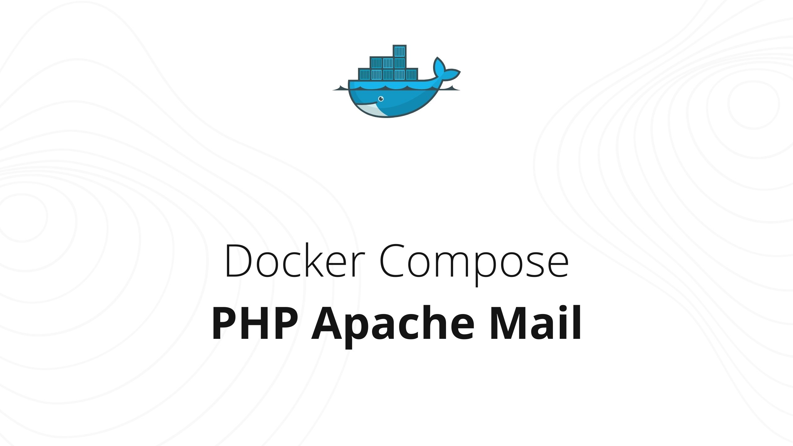

# Docker Compose PHP Apache + Mailhog

Docker Compose project to deploy development environment for PHP. Configured to store files changes locally in project folder matching the purpose of completely storing project in github. Additionally empowered with [Mailhog](https://github.com/mailhog/MailHog) - email testing tool.

## Features

- 📦 PHP Apache and Email Testing
- 🗂️ File changes storing in project folder
- 🚀 Commit changes to github repository

**For development purpose only, don't use in production.**

## 🚀 Getting Started

### 1. Clone repository

```bash
git clone https://github.com/dendrofen/docker-compose-php-apache-mail
```

### 2. Docker compose

Run docker compose in cloned project folder

```bash
docker-compose up -d
```

### 3. Start your changes

Once docker-compose run completed, you are free to make changes under www folder.

## 🔗 Interface links

- **Server**

  - [http://localhost/](http://localhost/)

- **Mailhog**
  - [http://localhost:8025/](http://localhost:8025/)

## 🧑🏻‍💻 PHP Environment

### Project Structure

Folder www contains files using on server, this should be considered as root server directory. All changes should be made under this directory.

### Persisted www

Changes per this directory would be synced with docker container as normally called - volume persistance. Your changes would be live-synced with docker container and visa-versa.

### PHP settings

**.docker/php/php.ini** file includes settings for php

❗️ **Note:** Reload the container to see changes if modified
